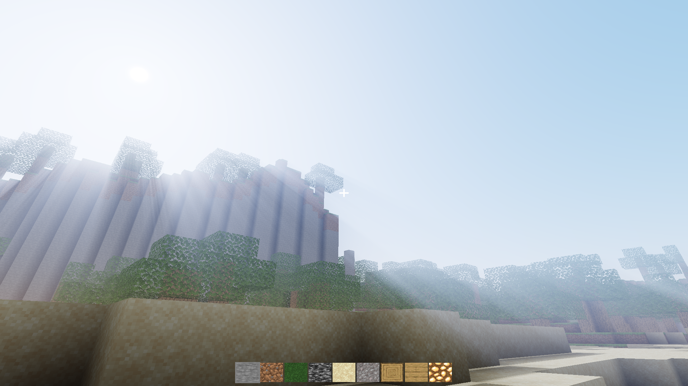
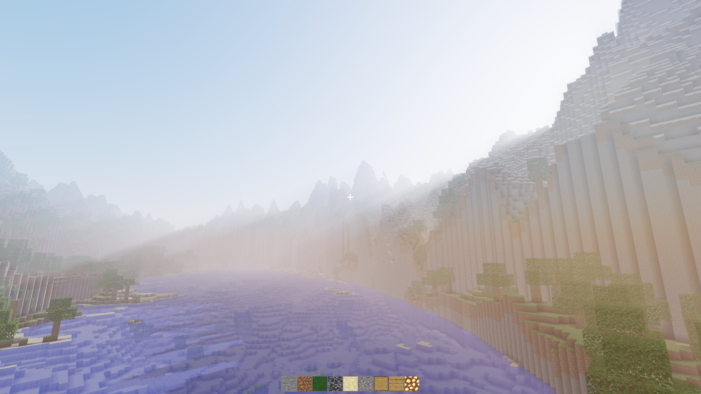

# Minecraft Clone

[](https://openjdk.org/projects/jdk/21/)
[](https://gradle.org/)
[](https://www.opengl.org/)

## Overview

A **Minecraft clone** built from scratch in **Java 21** using **LWJGL** (OpenGL 3.3 core, GLFW) and **JOML** for 3D math. The project uses a **domain driven architecture** — the domain layer (world, blocks, player) knows nothing about OpenGL, GLFW, or threads. The project is currently in active development.

> **Not an official Minecraft product.** This is an independent, non-commercial project
> written from scratch as a learning exercise in graphics and engine programming. It is not
> approved by, endorsed by, or associated with Mojang Studios or Microsoft, and it shares no
> code or assets with Minecraft. "Minecraft" is a trademark of Mojang Studios.

---

## Screenshots





---

## What's in it

- **Infinite streaming world** — chunks generate on background threads and upload to the GPU on the main thread, so terrain streams in without frame hitches.
- **Procedural generation** — OpenSimplex2 noise, composable biome and terrain specs, tree placement.
- **Build and break** — DDA raycast block targeting, a 9-slot hotbar, and edits that survive a restart.
- **Rendering** — texture atlas from a JSON resource pack, frustum culling, a separate transparent pass for water, ambient occlusion, distance fog, and sky lighting.
- **Physics** — swept AABB collision against solid blocks, gravity, ground detection, and a creative fly mode.
- **Audio** — OpenAL playback with OGG decoding through STB.

Not built yet: items, crafting, mobs, health, and multiplayer.

---

## Controls

| Key | Action |
|-----|--------|
| `WASD` | Move |
| `Mouse` | Look |
| `Left Click` | Break block |
| `Right Click` | Place block |
| `Scroll Wheel` | Cycle hotbar |
| `1`–`9` | Select hotbar slot |
| `Space` | Jump |
| `Double-tap Space` | Toggle creative fly |
| `Left Shift` | Sneak — descend while flying |
| `F5` | Reload shaders without restarting |
| `X` / `Esc` | Quit |

---

## Getting Started

### Prerequisites

- [**Java 21**](https://www.azul.com/downloads/) (Azul Zulu recommended)
- Gradle wrapper included — no separate install needed

### Recommended IDE

[**IntelliJ IDEA**](https://www.jetbrains.com/idea/) with the Gradle plugin provides the best experience for this project.

### Run

```bash
git clone https://github.com/BenEklundCS/Minecraft.git
cd Minecraft
./gradlew run
```

### Test

```bash
./gradlew test                  # unit tests
./gradlew build                 # format check, checkstyle, compile, unit tests
./gradlew integrationTest       # slow suite — spins up real chunk managers
```

Test reports are written to `build/reports/tests/test/index.html`.

Integration tests are deliberately excluded from `check` and `build`, because they take
minutes rather than seconds. Run them by hand when touching the chunk pipeline.

### Format

Spotless (palantir-java-format) and Checkstyle both run as part of `build`. A pre-commit hook
in `.githooks` formats staged Java automatically — `./gradlew build` installs it by pointing
`core.hooksPath` at that directory, so a fresh clone picks it up the first time it builds.

```bash
./gradlew spotlessApply
```

---

## Configuration

Launch settings — seed, render distance, FOV, window size, resource pack, spawn — live in
`ContainerConfig.defaults()`.

Optional per-machine overrides go in a `local.properties` file at the repo root. It is
gitignored and entirely optional:

```properties
preferred.album=public        # restrict startup music to one album folder
startup.disc=music/public/Kai_Engel_-_01_-_Prologue.ogg
debug.enabled=true
```

### Logging

Logging is split into per-subsystem categories — `chunk`, `world`, `render`, `gpu`, `input`,
`player`, `io`, `audio`, `perf` — each independently filterable at runtime:

```bash
./gradlew run -Dlog.all=DEBUG                    # everything talks
./gradlew run -Dlog.chunk=TRACE                  # only chunk streaming, rest stay at INFO
./gradlew run -Dlog.all=DEBUG -Dlog.perf=OFF     # everything but the per-second summary
```

Logback re-scans its config every five seconds, so levels can also be changed mid-session.

---

## Architecture

```
core/      no GL, no GLFW, no window — none of it is even on the classpath
  block/           Block types, BlockDef, BlockRegistry
  world/           Chunk, World, IWorldAuthority, ChunkState, lighting
    gen/           Biome and TerrainProfile only — biome *data*, which the mesher needs
  player/          IPhysicsBody, Physics, PlayerState, Interaction, Hotbar
  entity/          Entity, IEntityStrategy — stubs, no mobs yet
  util/            Stateless utilities — Raycast (DDA), AABB, Direction, OpenSimplex2
  net/             Packets and links — the client/server seam

server/    headless: generates, stores, owns the authoritative world; never meshes
  world/gen/       World generation (pure factory: ChunkPos + seed → Chunk)
  world/           ServerWorldAuthority
  infra/           ServerChunkManager (load radius, generation pool), SaveFile + ChunkStore + PlayerStore
  net/             GameServer, PlayerSession, IChunkStreamer (which chunks each player may have)
  container/       ServerContainer, ServerConfig — server composition root and tick thread

client/    everything that touches a GPU, a window, a keyboard or a speaker
  renderer/        ChunkMesher, Camera, ShaderProgram, TextureAtlas
  platform/
    window/        GLFW window lifecycle
    input/         Raw GLFW events → IInputAction (anti-corruption layer)
    graphics/      OpenGL objects — GlShader, Gl*Buffer, GlVertexArray, GlTexture, meshes
    audio/         OpenAL playback, STB Vorbis decoding
    images/        STB image loading
    resources/     JSON resource packs
  input/           Game-vocabulary input actions, not GLFW keycodes
  infra/           ClientChunkManager (replica, meshing pool), ClientWorldAuthority, RenderWorld
  container/       GameContainer — client composition root;
                   ContainerConfig carries every launch knob

launcher/  Main, LaunchMode, Launcher — Host runs both halves in one process over an InJvmLink
```

The arrows are `launcher → client → core` and `launcher → server → core`. Client cannot see
server and server cannot see client, which is the entire reason these are Gradle modules rather
than packages: the dependency rule below is a compile error instead of something you have to
remember.

Three rules shape the codebase:

1. **Dependencies point one way.** The domain depends on nothing outside itself. Platform adapters own the hardware. `infra/` may depend on everything; `container/` wires it together.
2. **Only the main thread calls OpenGL.** Generation and meshing run on worker pools and produce plain arrays; the main thread turns those into GPU buffers, capped per frame.
3. **No singletons.** Every dependency arrives through a constructor, and the two containers (`GameContainer`, `ServerContainer`) are the only places that call `new` on platform, renderer, world, or infrastructure types.

The load-bearing details are documented where they're enforced: the composition-root ordering
contract is a numbered comment block in `GameContainer`, and the chunk state machine and its
thread-safety rules are commented in `ChunkState`, `ServerChunkManager` and `ClientChunkManager`.

---

## Saves

Worlds live in `saves/<seed>/` — chunks as `<x>_<z>.bin`, the player as `level.dat`. Both
share one binary layout: a 12-byte header (magic number, format version, payload length)
followed by the payload.

Reads validate the magic and length and fall back to "no save" instead of throwing, so a
foreign or truncated file regenerates rather than crashing the game. Writes go to a temp
file and are moved into place atomically, so a crash mid-save can't leave a half-written
world behind.

The save directory is derived from the world seed, so changing the seed starts a fresh
world rather than overwriting an existing one. `saves/` is gitignored.

---

## Credits and Licensing

The engine code is MIT licensed — see [LICENSE](LICENSE).

The bundled assets are third-party work under their own terms. Full attribution lives in
[`client/src/main/resources/CREDITS.txt`](client/src/main/resources/CREDITS.txt); the short version:

| Asset | Source | License |
|-------|--------|---------|
| Textures — `packs/faithful/` | [Faithful](https://faithfulpack.net), via [Zormein's Faithful Clone](https://github.com/Zormein/Faithful-Clone) port for MineClone2/VoxeLibre | CC BY-SA 4.0 |
| Sounds — `sounds/` | [Minetest Game / Luanti](https://github.com/luanti-org/minetest_game) | CC BY-SA 3.0 |
| Music — `music/public/` | Kai Engel | CC0 |

Textures come from the **[Faithful](https://faithfulpack.net)** pack, whose
[license](https://faithfulpack.net/license) permits use in non-Minecraft projects with credit
and a visible link back. Both are given here and in `CREDITS.txt`. If you fork this and ship
anything from it, keep that attribution intact.
